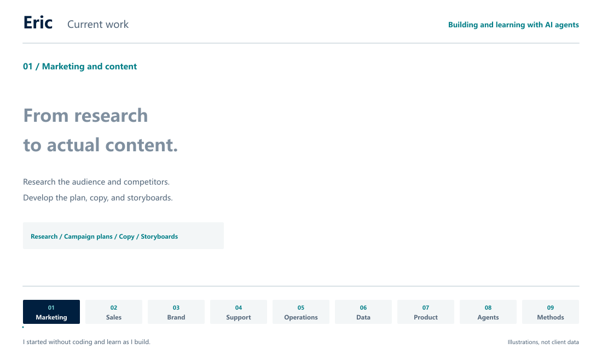

<a href="https://github.com/NewenergyEric">中文</a> · <strong>English</strong>

<picture>
  <source media="(prefers-reduced-motion: reduce)" srcset="media/work-still-en.png">
  
</picture>

<a href="media/work-still-en.png">Still image</a>

# What I am building with agents

I started without knowing how to code. Now I work with AI agents on tools I want to use myself. The work covers marketing, sales, brand, customer support, and data analysis. Much of it starts with a problem I have run into at work.

I care about whether the result is useful, so I try it myself and keep changing what feels awkward. Along the way, I am learning to explain problems and judge an agent’s work. I keep methods that work in documents and skills so I can use them again.

These are the areas I am working on. Some are still prototypes; others are being tried in practice. I leave out project names where clients are involved.

## Marketing and content

I am connecting audience and competitor research with campaign planning, copy, and video storyboards. The research should help when it is time to make the content. I am also organizing approaches for different channels so they are easier to revise and use again.

## Sales and partnerships

I use agents to research prospects, creators, and potential partners, including why a conversation might be worth having. I am also working on proposal preparation and follow-up planning so each conversation has useful context behind it.

## Brand and positioning

I start with who the product is for and what problem it solves, then look at how competitors describe their products. That informs the positioning, selling points, brand story, and visual guidelines. I want the result to explain the product clearly.

## Customer support and knowledge

Customer support and knowledge systems are areas I keep working on. When information is scattered, replies can miss things. I am connecting retrieval, reply drafts, source checks, and human review, then using recurring questions to check how well the system answers.

## Operations and collaboration

Some work is straightforward until information is missing, approval is pending, or nobody knows who takes it next. I am organizing these steps into workflows that make the status, owner, and exceptions visible.

## Data and decisions

I work on advertising and business data, starting with cleanup and consistent metric definitions. Then I build dashboards, investigate unusual results, and prepare suggestions. I want to understand how a result was calculated and what might be worth changing next.

## Product and interaction

I am trying browser assistants, local tools, voice interaction, and learning experiences. Usually I build a first version with agents and use it from beginning to end myself. Once it runs, there is still work to do on the parts that feel awkward or confusing.

## Agent workflows

I am also building custom agents and shared workspaces by combining knowledge, tools, and skills. I spend time checking what material an agent used, which tools it called, when it needs my confirmation, and how to trace an error.

## Methods and training

I keep notes on the decisions, failures, and revisions, then turn them into guides, course exercises, or skills. That gives me a place to start when a similar problem comes up, and something concrete to discuss with other people.

## How I work with agents

I usually start by explaining what I want to do and why. Agents help with the research and implementation, and we check the result together. Some ideas change after I try them; some get put aside. A useful tool or a better understanding of a problem is a worthwhile result for me.
