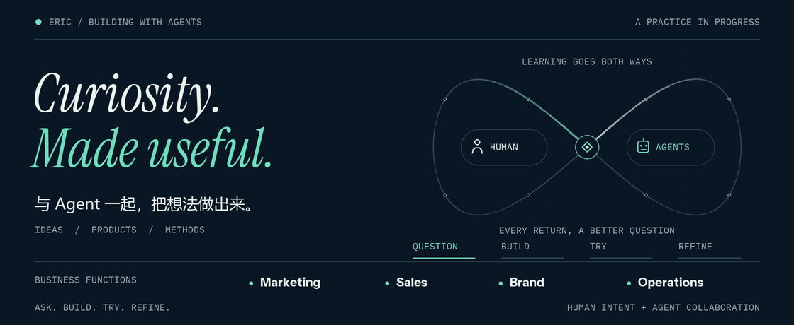

<a href="https://github.com/NewenergyEric">中文</a> · <strong>English</strong>

<picture>
  <source media="(prefers-reduced-motion: reduce)" srcset="collaboration-still.png">
  
</picture>

<a href="collaboration-still.png">Still image / 静态封面</a>

# I'm Eric

**I started without knowing how to code. Now I build with AI agents and learn as I go.**

I bring everyday business problems into development: a report that needs repeated cleanup, a decision with little evidence behind it, a process held together by manual handoffs.

I define the goal, provide the business context, and check the results. Agents help me research, write code, and build prototypes. That is also how I learn to develop: by trying things and feeding what I learn back into the tools and methods.

I want ideas to become things people use, thinking to become action, and methods to keep helping with the next piece of work.

---

## What I'm working on

### Brand and positioning · Make the product's value clear

I bring together audience research, competitor observations, and use cases to develop positioning, selling points, and brand stories, then carry those decisions into copy and visual guidelines.

### Marketing and content · Carry research into production

I'm building workflows that connect market research with campaign plans, channel copy, creative briefs, and storyboards. Product facts and the purpose of the communication need to survive each step.

### Sales and partnerships · Prepare for each conversation

I use agents to research prospects, creators, and potential partners, and to organize priorities, proposals, and follow-up preparation. The aim is to give sales a reason to reach out and a clear next step.

### Customer support and knowledge · Make answers traceable

I'm organizing scattered material into searchable knowledge so reply drafts can use the conversation's context, be checked against their sources, and receive human review. Recurring questions also become examples for the next round of improvements.

### Operations and collaboration · Close the gaps in handoffs

I turn questions often buried in chat into traceable workflows: whether the information is complete, who needs to approve it, where a task is stuck, and who takes over when something goes wrong.

### Data and decisions · Help reports inform the next action

I start with data cleanup and consistent definitions, then explore dashboards, diagnostics, and strategy reports for advertising and business data. Conclusions should trace back to the data, and recommendations should state when they apply.

### Product and interaction · Put prototypes to use

Browser assistants, local tools, voice interaction, and learning experiences are some of the forms I'm exploring. I build prototypes with agents, walk through the experience myself, and bring the problems I find into the next revision.

### Agent workflows · Make the work inspectable

I'm combining knowledge, tools, and skills to explore custom agents and shared workspaces. Alongside functionality, I keep refining evaluation, permissions, human review, and execution records.

### Methods and training · Keep what each attempt teaches

I turn decisions, failures, and reviews into operating guides, courses, exercises, and reusable skills. When a similar problem comes up, there should be something useful to build on.

*This work spans prototypes, validation, and pilots. I describe it through functions and methods without disclosing client identities, actual project names, internal material, or proprietary workflows.*

---

## Three things I keep practicing

**Define the goal before building.** Be clear about who will use it, what gets in their way, and what a useful result would look like.

**Use it before judging it.** I walk through a real workflow, note where it gets stuck or still needs manual help, and use that to decide what to change.

**Let feedback change the next collaboration.** Ask, build, try, review, then update the documentation, workflow, and skills. I want each collaboration with agents to benefit from what the last one taught me.

I'm happy to exchange ideas about working with agents, turning business problems into products, and learning to build from scratch.
