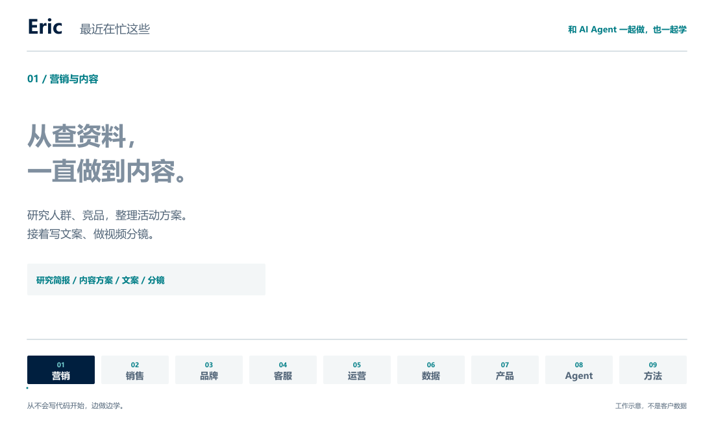

<strong>中文</strong> · <a href="https://github.com/NewenergyEric/NewenergyEric/blob/main/README.en.md">English</a>

<picture>
  <source media="(prefers-reduced-motion: reduce)" srcset="media/work-still-zh.png">
  
</picture>

<a href="media/work-still-zh.png">静态封面</a>

# 我在和 Agent 一起做什么

我从不会写代码开始，现在在和 AI Agent 一起做一些自己想用的工具。做的东西比较杂，营销、销售、品牌、客服，还有数据分析，很多都来自实际工作里碰到的问题。

我比较在意的是，做出来以后到底好不好用。所以会自己试，不顺就继续改。过程中也在学怎么把问题讲清楚，怎么判断 Agent 做得对不对。能用的方法会整理成文档和 Skill，下次接着用。

下面按职能写了我正在做的事情。有些还在做原型，有些已经进入试用。涉及客户的项目就不写名字了。

## 营销与内容

我在试着把营销工作接起来，从查人群、看竞品，到做方案、写文案和视频分镜。前面做的研究，后面做内容时应该能用上。我也在整理不同渠道的内容做法，方便反复修改和使用。

## 销售与商务拓展

销售这边，我在用 Agent 研究潜在客户、创作者和合作伙伴，整理值得接触的人，以及为什么值得聊。再往下是提案准备和跟进安排，尽量让每次沟通都有具体的背景。

## 品牌与定位

我会先看产品给谁用、解决什么问题，再看竞品怎么说。想清楚以后，再做定位、卖点、品牌故事和视觉规范。我希望最后的表达能说清楚这个产品。

## 客户服务与知识

客服和知识库是我一直在做的方向。资料散在不同地方，回答很容易漏信息。我在把检索、答复草稿、来源核对和人工审核接起来，也会用常见问题检查系统是不是回答得更稳了。

## 运营与团队协作

有些工作本身不复杂，麻烦在资料没齐、审批没走完，或者不知道该交给谁。我在把这些环节整理成流程，让任务状态、责任人和异常情况能看得见。

## 数据分析与决策

我在做广告和经营数据的分析，先把数据清洗和指标口径弄清楚，再做看板、找异常、整理建议。看到一个结果时，我想知道它是怎么算出来的，也想知道接下来能试着改什么。

## 产品与交互体验

浏览器助手、本地工具、语音交互和学习体验，我都有在尝试。通常先和 Agent 做一版，自己从头用一遍。功能能运行以后，还要继续看哪里不顺手、哪里容易让人误解。

## Agent 能力与流程工程

我也在做定制 Agent 和协作工作台，把知识、工具、Skill 组合起来。这里会花不少时间检查执行过程：拿到了什么资料，用了什么工具，哪里需要我来确认，以及出错以后怎么查。

## 方法沉淀与培训

做过的事情，我会把判断过程、失败和修改记下来，再整理成操作指南、课程练习或者 Skill。这样下次碰到类似问题，可以接着做，也方便拿出来和别人讨论。

## 我和 Agent 怎么一起做

通常是我先说明想做什么、为什么要做，让 Agent 帮忙研究和实现，再一起检查结果。有些想法试完会改，有些会暂时放下。每次做完，能留下一个好用的工具，或者搞清楚一个问题，我觉得就有价值。

English · Read the full introduction here

<picture>
  <source media="(prefers-reduced-motion: reduce)" srcset="media/work-still-en.png">
  
</picture>

<a href="media/work-still-en.png">Still image</a>

# What I am building with agents

I started without knowing how to code. Now I work with AI agents on tools I want to use myself. The work covers marketing, sales, brand, customer support, and data analysis. Much of it starts with a problem I have run into at work.

I care about whether the result is useful, so I try it myself and keep changing what feels awkward. Along the way, I am learning to explain problems and judge an agent’s work. I keep methods that work in documents and skills so I can use them again.

These are the areas I am working on. Some are still prototypes; others are being tried in practice. I leave out project names where clients are involved.

## Marketing and content

I am connecting audience and competitor research with campaign planning, copy, and video storyboards. The research should help when it is time to make the content. I am also organizing approaches for different channels so they are easier to revise and use again.

## Sales and partnerships

I use agents to research prospects, creators, and potential partners, including why a conversation might be worth having. I am also working on proposal preparation and follow-up planning so each conversation has useful context behind it.

## Brand and positioning

I start with who the product is for and what problem it solves, then look at how competitors describe their products. That informs the positioning, selling points, brand story, and visual guidelines. I want the result to explain the product clearly.

## Customer support and knowledge

Customer support and knowledge systems are areas I keep working on. When information is scattered, replies can miss things. I am connecting retrieval, reply drafts, source checks, and human review, then using recurring questions to check how well the system answers.

## Operations and collaboration

Some work is straightforward until information is missing, approval is pending, or nobody knows who takes it next. I am organizing these steps into workflows that make the status, owner, and exceptions visible.

## Data and decisions

I work on advertising and business data, starting with cleanup and consistent metric definitions. Then I build dashboards, investigate unusual results, and prepare suggestions. I want to understand how a result was calculated and what might be worth changing next.

## Product and interaction

I am trying browser assistants, local tools, voice interaction, and learning experiences. Usually I build a first version with agents and use it from beginning to end myself. Once it runs, there is still work to do on the parts that feel awkward or confusing.

## Agent workflows

I am also building custom agents and shared workspaces by combining knowledge, tools, and skills. I spend time checking what material an agent used, which tools it called, when it needs my confirmation, and how to trace an error.

## Methods and training

I keep notes on the decisions, failures, and revisions, then turn them into guides, course exercises, or skills. That gives me a place to start when a similar problem comes up, and something concrete to discuss with other people.

## How I work with agents

I usually start by explaining what I want to do and why. Agents help with the research and implementation, and we check the result together. Some ideas change after I try them; some get put aside. A useful tool or a better understanding of a problem is a worthwhile result for me.

