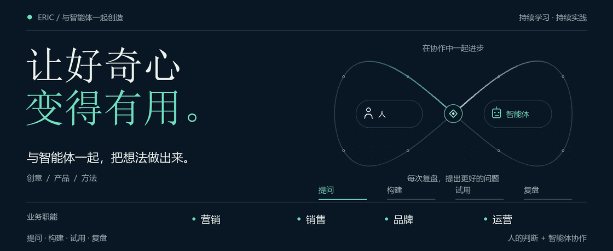
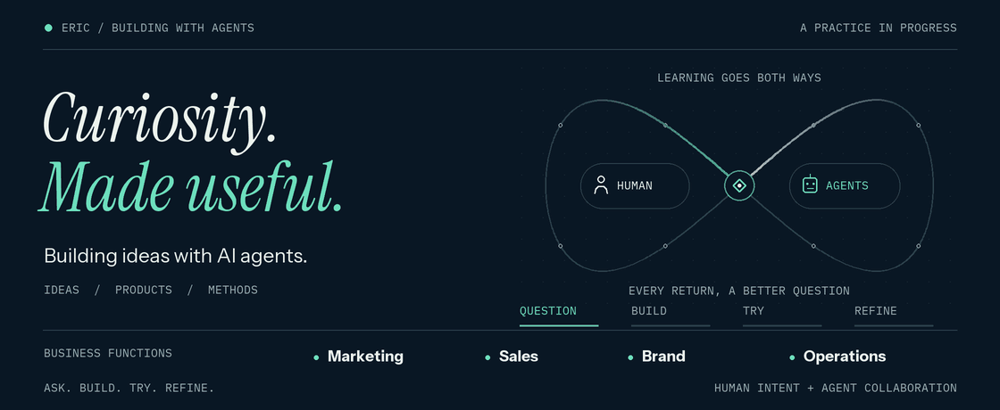

<strong>中文</strong> · <a href="https://github.com/NewenergyEric/NewenergyEric/blob/main/README.en.md">English</a>

<picture>
  <source media="(prefers-reduced-motion: reduce)" srcset="collaboration-still-zh.png">
  
</picture>

<a href="collaboration-still-zh.png">静态封面</a>

# 我是 Eric

**从不会写代码开始，和 AI Agent 一起把想法做出来。**

我把业务里的问题带进开发：一份反复整理的报表，一次缺少依据的判断，一段总要人工衔接的流程。

我来说明目标、提供业务背景、检查结果；Agent 帮我研究、写代码、做原型。我也在这个过程中学习开发，把试用中的反馈写回工具和方法。

我想让创意有人用，让思考能执行，让方法在下一次工作里继续产生价值。

---

## 我正在做什么

### 品牌与定位 · 把产品的价值说清楚

我把人群研究、竞品观察和使用场景放在一起，提炼定位、卖点和品牌故事，再把它们落实到文案与视觉规范。

### 营销与内容 · 从研究走到内容制作

我在做从市场研究到内容制作的工作流程：活动方案、跨渠道文案、创意简报、视频分镜。产品事实和传播目的，要能一路保留下来。

### 销售与商务拓展 · 让每次接触都有准备

我用 Agent 研究潜在客户、创作者和合作伙伴，整理优先级、提案和跟进准备。希望交到销售手里的，有接触的理由，也有清楚的下一步。

### 客户服务与知识 · 让回答找得到依据

我在把分散资料整理成可检索的知识，让客服答复能结合上下文起草、回到原始资料核对、经过人工审核。常见问题也会成为下一轮改进的样本。

### 运营与团队协作 · 把交接的空白补上

资料是否齐全、谁来审批、任务卡在哪里、异常由谁接手——我把这些容易藏在聊天里的问题，整理进可追踪的流程。

### 数据分析与决策 · 让报表支持下一步行动

我从清洗数据、统一口径做起，尝试把广告与经营数据整理成看板、诊断和策略报告。每个结论都要能回到数据，每份建议都要说明适用条件。

### 产品与交互体验 · 让原型接受真实使用

浏览器助手、本地工具、语音交互、学习体验，都是我在尝试的形式。我和 Agent 一起做出原型，再亲自走一遍流程，把使用中遇到的问题带回下一轮修改。

### Agent 能力与流程工程 · 让协作过程可以检查

我在组合知识、工具和 Skill，探索定制 Agent 与协作工作台。除了功能，也持续打磨评测、权限、人工审核和执行记录。

### 方法沉淀与培训 · 把一次探索留下来

我把项目中的判断、失败和复盘写成操作指南、课程、练习和可复用 Skill。以后遇到相似问题，有经验可以接着用。

*这些工作涵盖原型开发、功能验证与试点探索。这里用职能和方法介绍实践，不披露客户身份、真实项目名称、内部资料或专属流程。*

---

## 我在反复练习的三件事

**先把目标说清楚。** 谁会使用、哪里不顺、怎样算完成，尽量在动手前讲明白。

**亲自用过，再下判断。** 我会走完一段实际流程，记录哪里卡住、哪里仍要人工补位，再决定怎样改。

**让反馈改变下一次协作。** 提问、构建、试用、复盘，再更新文档、流程和 Skill。我希望自己与 Agent 的每一次合作，都能用上上一次留下的经验。

欢迎交流 Agent 协作、业务问题的产品化，以及从零开始把想法做出来的过程。

English · Read the full introduction here

<picture>
  <source media="(prefers-reduced-motion: reduce)" srcset="collaboration-still-en.png">
  
</picture>

<a href="collaboration-still-en.png">Still image</a>

# I'm Eric

**I started without knowing how to code. Now I build with AI agents and learn as I go.**

I bring everyday business problems into development: a report that needs repeated cleanup, a decision with little evidence behind it, a process held together by manual handoffs.

I define the goal, provide the business context, and check the results. Agents help me research, write code, and build prototypes. That is also how I learn to develop: by trying things and feeding what I learn back into the tools and methods.

I want ideas to become things people use, thinking to become action, and methods to keep helping with the next piece of work.

---

## What I'm working on

### Brand and positioning · Make the product's value clear

I bring together audience research, competitor observations, and use cases to develop positioning, selling points, and brand stories, then carry those decisions into copy and visual guidelines.

### Marketing and content · Carry research into production

I'm building workflows that connect market research with campaign plans, channel copy, creative briefs, and storyboards. Product facts and the purpose of the communication need to survive each step.

### Sales and partnerships · Prepare for each conversation

I use agents to research prospects, creators, and potential partners, and to organize priorities, proposals, and follow-up preparation. The aim is to give sales a reason to reach out and a clear next step.

### Customer support and knowledge · Make answers traceable

I'm organizing scattered material into searchable knowledge so reply drafts can use the conversation's context, be checked against their sources, and receive human review. Recurring questions also become examples for the next round of improvements.

### Operations and collaboration · Close the gaps in handoffs

I turn questions often buried in chat into traceable workflows: whether the information is complete, who needs to approve it, where a task is stuck, and who takes over when something goes wrong.

### Data and decisions · Help reports inform the next action

I start with data cleanup and consistent definitions, then explore dashboards, diagnostics, and strategy reports for advertising and business data. Conclusions should trace back to the data, and recommendations should state when they apply.

### Product and interaction · Put prototypes to use

Browser assistants, local tools, voice interaction, and learning experiences are some of the forms I'm exploring. I build prototypes with agents, walk through the experience myself, and bring the problems I find into the next revision.

### Agent workflows · Make the work inspectable

I'm combining knowledge, tools, and skills to explore custom agents and shared workspaces. Alongside functionality, I keep refining evaluation, permissions, human review, and execution records.

### Methods and training · Keep what each attempt teaches

I turn decisions, failures, and reviews into operating guides, courses, exercises, and reusable skills. When a similar problem comes up, there should be something useful to build on.

*This work spans prototypes, validation, and pilots. I describe it through functions and methods without disclosing client identities, actual project names, internal material, or proprietary workflows.*

---

## Three things I keep practicing

**Define the goal before building.** Be clear about who will use it, what gets in their way, and what a useful result would look like.

**Use it before judging it.** I walk through a real workflow, note where it gets stuck or still needs manual help, and use that to decide what to change.

**Let feedback change the next collaboration.** Ask, build, try, review, then update the documentation, workflow, and skills. I want each collaboration with agents to benefit from what the last one taught me.

I'm happy to exchange ideas about working with agents, turning business problems into products, and learning to build from scratch.

